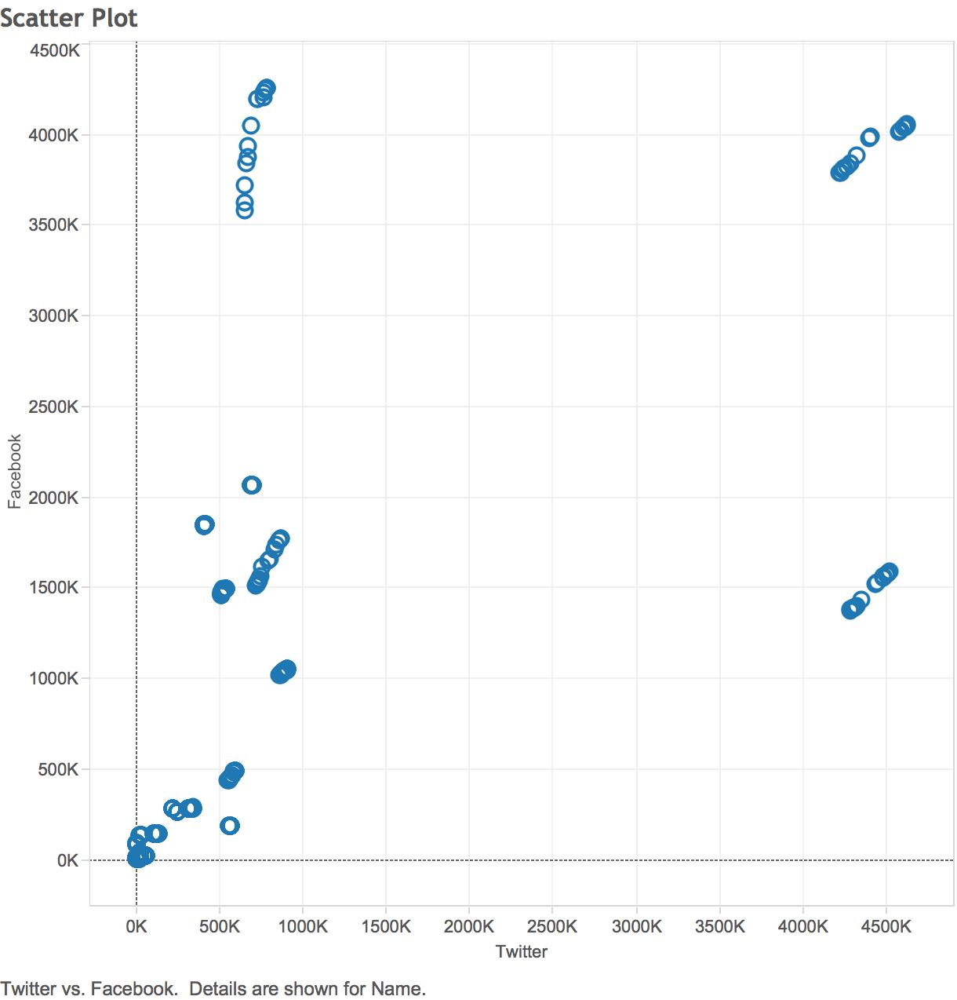
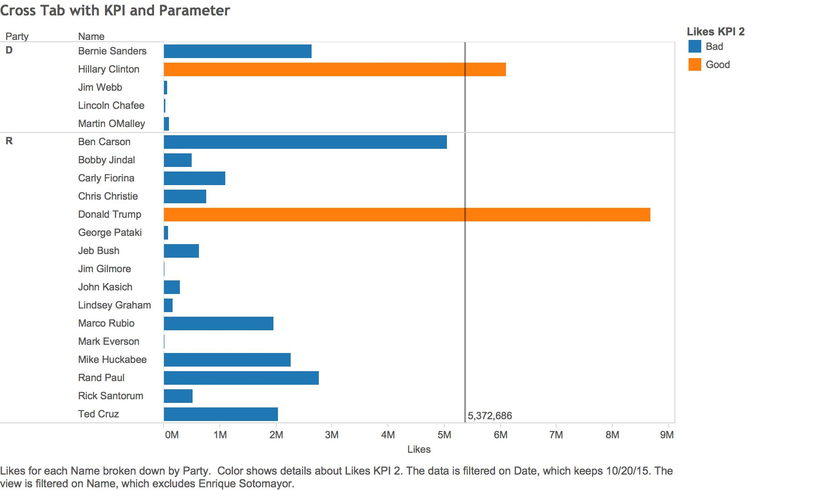
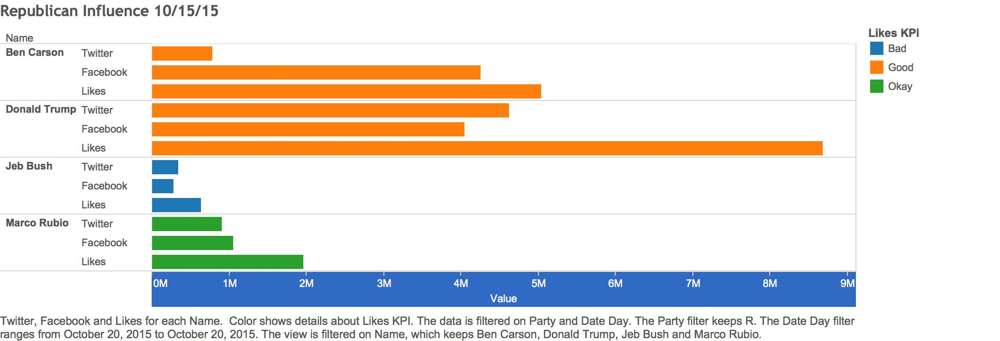

Social Media Campaigns of Prsidential Candidates
=============

```{r}
source('~/Desktop/DV_TProject1/01 Data/socialMedia.R', echo = TRUE)
```


```{r}
source('~/Desktop/DV_TProject1/01 Data/R_Load.R', echo = TRUE)
```


###Scatter Plot

This plot shows how candidates from both politial parties are doing on the two largest social media platforms of the day, Facebook and Twitter. 

The scatter plot shows a big discrepancy between those who have a strong social presense, and those who rely on their political platform to gain traction.

It's interesting to see the difference between someone like Donald Trump, who's very highly talked about through both Twitter and Facebook for his unique social standing, versus Bernie Sanders, who's platform is well known but doesn't say as many unique things as Donald Trump.




<br></br>
**In R:**
<br></br><br></br>


```{r}
source('~/Desktop/DV_TProject1/01 Data/scatterplot.R', echo = TRUE)
```


<br></br>
<br></br><br></br>
<br></br><br></br>
<br></br>


###Crosstab


This crosstab shows the amount of Likes each presidential candidate has received. We categorized the candidates by political party, and the orange bars represent the candidates who received more Likes than the ideal amount, which is set at 5,372,686. Anything below that, is less ideal and therefore we consider it a Bad amount of Likes to have

We found it interesting that the leading candidates for each party, both being the only ones with a Good number of Likes, as being Donald Trump and Hilary Clinton. Clinton has been a key part of the government for many years and is therefore very well known, whereas Donald Trump recently chose to participate in the government and has made a very strong social presense.




###Bar Chart

This barchart represents four of the presidential candidates--Ben Carson, Donald Trump, Jeb Bush, and Marco Rubio--and compares how popular they each are amongst social media. The orange represents they're mentioned in an ideal amount of Facebook or Twitter posts, or have an ideal amount of likes. Green indicates that although these numbers aren't ideal, the candidate is still in a good social media standing. And blue indicates that the candidate isn't very much noticed amongst social media outlets.

An interesting trend amongst all four candidates is that they all have more Likes than amounts of mentions on Twitter and Facebook. Additionally, it's interesting to note the difference in Likes amongst the four candidates, Trump having the most, Carson being decent but still far behind Trump, Rubio being in so-so territory, and Bush being behind by thousands.



<br></br>
**In SQL:**
<br></br><br></br>
**I would first select * from SOCIALMEDIADATA where( (DATE_ = '10/20/15') and (NAME_ = 'Ben Carson' or NAME_ = 'Donald Trump' or NAME_ = 'Jeb Bush' or NAME_ = 'Marco Rubio'))**
<br></br><br></br>
**Then I would define the KPI exactly as I did on Tableau; If likes > 2M -> Good; Elif likes > 1M -> Okay; Else -> Bad; End**
<br></br>
